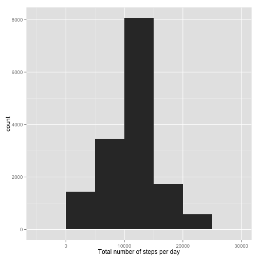
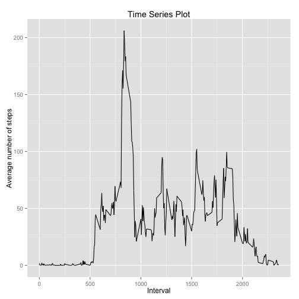
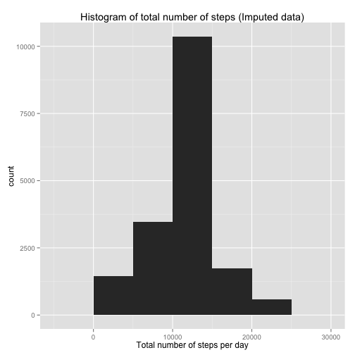
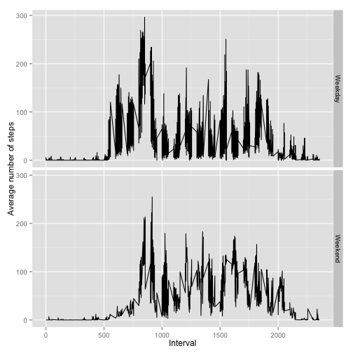

## Loading and preprocessing the data

The first step is to get the data from GitHub repository and store in a file.


```r
fileURL<-"https://d396qusza40orc.cloudfront.net/repdata%2Fdata%2Factivity.zip"
```

Since the data is stored in .zip format, we first need to unzip the file while downloading. Then we can read the csv file.


```r
testDir = tempdir()
destFile <- tempfile(tmpdir=testDir, fileext=".zip")
download.file(fileURL,destFile, method="curl")
fname = unzip(destFile, list=TRUE)$Name[1]
unzip(destFile, files=fname, overwrite=TRUE)
ActivityData <- read.csv("activity.csv")
unlink(destFile)
```

Now, the data is in a format that can be run. 

## What is mean total number of steps taken per day?

One of the first steps of data analysis is to see the histogram of our data. We use the ggplot2 package for this assignment. I use tapply() function to get the sum of steps based on the "date" category and store them in the data frame. Then by qplot() I plotted the histogram of the sum of steps per day.


```r
library(ggplot2)
ActivityData$SumSteps<-tapply(ActivityData$steps,ActivityData$date,sum)
qplot(SumSteps, data=ActivityData, binwidth=5000, xlab = "Total number of steps per day")
```

 

In order to calculate the mean and median of the total steps per day, we need to simply use the mean() and median() functions.


```r
mean_steps<-mean(ActivityData$SumSteps, na.rm=TRUE)
mean_steps
```

```
## [1] 10766.19
```


```r
median_steps<-median(ActivityData$SumSteps, na.rm=TRUE)
median_steps
```

```
## [1] 10765
```

The mean of the total number of steps per day in our data set is 1.0766189 &times; 10<sup>4</sup> and the median is 1.0765 &times; 10<sup>4</sup>. 

## What is the average daily activity pattern?
To see the activity pattern of the daily average, we can make a time series plot of the 5-minute interval (x-axis) and the average number of steps taken, averaged across all days (y-axis).


```r
ActivityData$AverageSteps <- tapply(ActivityData$steps,ActivityData$interval,mean,na.rm=TRUE)
qplot(interval, AverageSteps, data=ActivityData, geom="line", main="Time Series Plot", xlab="Interval", ylab="Average number of steps")
```

 

Now which 5-minute interval, on average across all the days in the dataset, contains the maximum number of steps?

```r
max_id<-which.max(ActivityData$AverageSteps)
max_step<-ActivityData[max_id,]$interval
max_step
```

```
## [1] 835
```

The maximum number of steps happens on the 835th interval, which should be around 8:30 am.

## Imputing missing values
To calculate the number of missing data, I find the NA s in the dataset, using is.na() function. Summing over all the TRUE values, will return the desired total number of rows with NA s.


```r
sum_NA<-sum(is.na(ActivityData$steps))
sum_NA
```

```
## [1] 2304
```

Total number of NA s in our dataset is 2304.

### Imputation Strategy:
For filling the missing values, various ways are suggested one of which is replacing NA values with the mean of the 5-minute interval.


```r
for (i in 1:nrow(ActivityData)){
  if (is.na(ActivityData$steps[i])){
    ActivityData$steps[i] <- ActivityData$AverageSteps[i]
  }
}
```
Now, we create a new data set that includes the imputed data.


```r
ActivityData$SumStepsImputed<-tapply(ActivityData$steps,ActivityData$date,sum)
```

The histogram of the total nmber of steps with the filled NA s is plotted for comparison with the original histogram.


```r
qplot(SumStepsImputed, data=ActivityData, binwidth=5000, main="Histogram of total number of steps (Imputed data)", xlab = "Total number of steps per day")
```

 

The mean and median of the imputed data is calculated for comparison with the original dataset.


```r
mean_steps_imp<-mean(ActivityData$SumStepsImputed, na.rm=TRUE)
mean_steps_imp
```

```
## [1] 10766.19
```


```r
median_steps_imp<-median(ActivityData$SumStepsImputed, na.rm=TRUE)
median_steps_imp
```

```
## [1] 10766.19
```

New values of mean and median are 1.0766189 &times; 10<sup>4</sup>, and 1.0766189 &times; 10<sup>4</sup>, respectively. Comparing the 1.0766189 &times; 10<sup>4</sup> and 1.0765 &times; 10<sup>4</sup>, we can see that the new numbers are quite similar, with very small variation.

## Are there differences in activity patterns between weekdays and weekends?

First, we need to find the "weekday" and "weekend" activities by categorizing accordingly in the data, and storing the dataset for future analyses.

```r
ActivityData$date <- as.Date(ActivityData$date, "%Y-%m-%d")
ActivityData$day <- weekdays(ActivityData$date)
ActivityData$day_type<- ifelse(ActivityData$day == "Saturday" | ActivityData$day == "Sunday", "weekend", "weekday")
```

Now, we would like to find the average number of steps per weekdays and weekends. To do that, we use an aggregate function for finding the mean of the steps based on the type of the day, day of the week, and the interval value. Then, in our new data set, we can again define the weekend and weekday types, and plot our time series, accordingly.


```r
mean_data <- aggregate(ActivityData$steps, 
                       by=list(ActivityData$day_type, 
                               ActivityData$day, ActivityData$interval), mean)
names(mean_data) <- c("daytype", "day", "interval", "mean")
mean_data$daytype<- ifelse(mean_data$day == "Saturday" | mean_data$day == "Sunday", "Weekend", "Weekday")

qplot(interval, mean, data=mean_data, facets=daytype~., geom="line", xlab="Interval", ylab="Average number of steps")
```

 

AT the end, to free up our workspace, we remove all the data frames.


```r
rm(ActivityData, mean_data)
```

